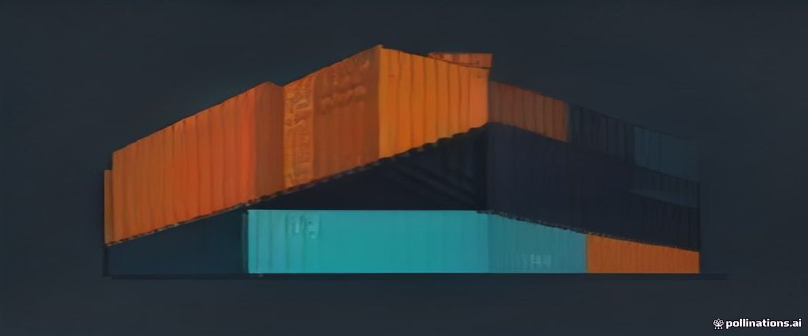

> **Estado: esqueleto.** Este capítulo es parte del roadmap navegable.
> Contenido planeado abajo; se redacta siguiendo `_plantilla.qmd` y
> `docs/guia-de-estilo.md`.

## El problema

El nuevo dev tarda dos días en arrancar el proyecto. Necesitamos empaquetar la app completa: contenedores.

## Cómo lo resuelve un equipo

<!-- TODO: contexto profesional -->

## Conceptos nuevos

- <span class="tag tag-ops">Ops</span> Qué es un contenedor (sin la teoría de namespaces): máquina mínima reproducible
- <span class="tag tag-ops">Ops</span> Imagen vs contenedor vs Dockerfile: la analogía clase/instancia
- <span class="tag tag-ops">Ops</span> Dockerfile por lenguaje: `tsc`→runtime vs venv vs **binario estático de ~15MB**
- <span class="tag tag-ops">Ops</span> `.dockerignore`: qué nunca entra en una imagen

## La explicación visual

<!-- TODO: diagrama Mermaid o tabla -->

## Implementación

::: {.panel-tabset}

### TypeScript
```ts
// TODO
```

### Python
```python
# TODO
```

### Go
```go
// TODO
```

:::

<!-- proyecto: imagen de Taskflow corriendo con docker run -->

## ¿Por qué cada stack lo hace así?

<!-- TODO: la lección transferible tras el tabset -->

## Errores comunes

<!-- TODO -->

## Buenas prácticas

<!-- TODO -->

## Ejercicio

<!-- TODO: guiado, sobre el proyecto -->

## Mini reto

Reducir el tamaño de la imagen a la mitad explicando cada decisión (spoiler: Go gana).

## Lo que deberías saber hacer ahora

- [ ] <!-- TODO: checklist -->
